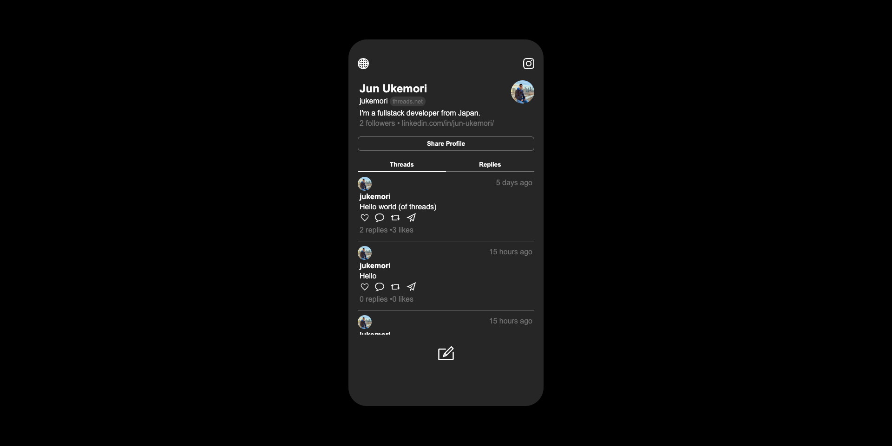

# Threads clone

This is a React app written in TypeScript that allows users to interact with threads and replies. Users can view and create threads, as well as post replies.





## Prerequisites

Before running the app, ensure you have the following installed:

- Node.js
- npm (Node Package Manager)


## Technologies Used
- React
- TypeScript
- Vite

## Getting Started
### Setup

``` shell
$ git clone git@github.com:jukemori/react-threads-clone.git
$ cd react-threads-clone
$ npm install # or yarn install
$ npm run dev # or yarn dev
$ open http://localhost:5173
```

## Launch API Server

``` shell
$ npx json-server --watch db.json
$ open http://localhost:3000
```

## Features
- Nav Component: Displays user information, including a link to their Instagram profile.
- Header Component: Allows users to toggle between viewing stand-alone threads and reply threads.
- Feed Component: Displays the user's threads and allows them to interact with threads and replies.
- PopUp Component: Opens a pop-up for composing new threads or replies, including posting functionality.
- WriteIcon Component: Clicking on this icon opens the PopUp for composing a new thread.

## API Endpoints
The app interacts with the following API endpoints served by json-server

- GET /users?user_uuid=<user_uuid>: Retrieve user information based on the provided user UUID.
- GET /threads?thread_from=<user_uuid>: Retrieve threads created by the specified user UUID.
- GET /threads?reply_to=<thread_id>: Retrieve replies associated with the specified thread ID.
- PUT /threads: Update a thread's amount of likes and replies
- POST /threads: Create a new thread or reply by sending a JSON payload.


